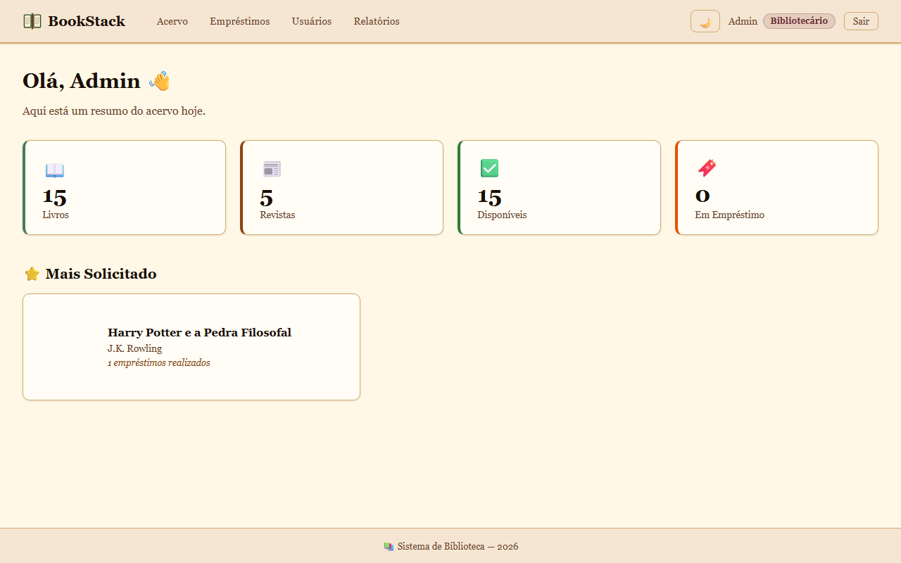
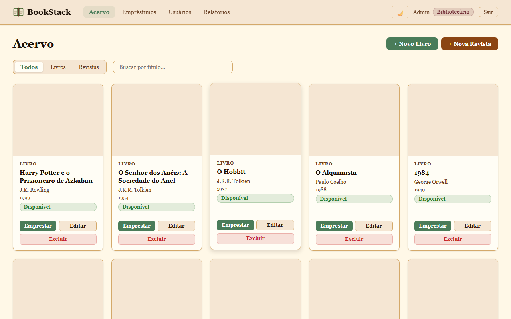
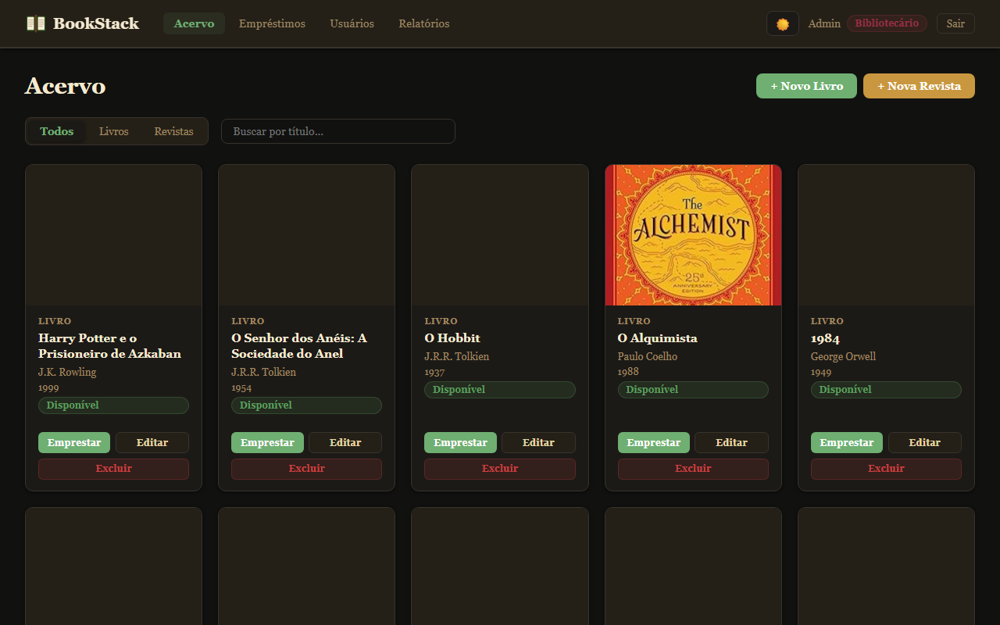
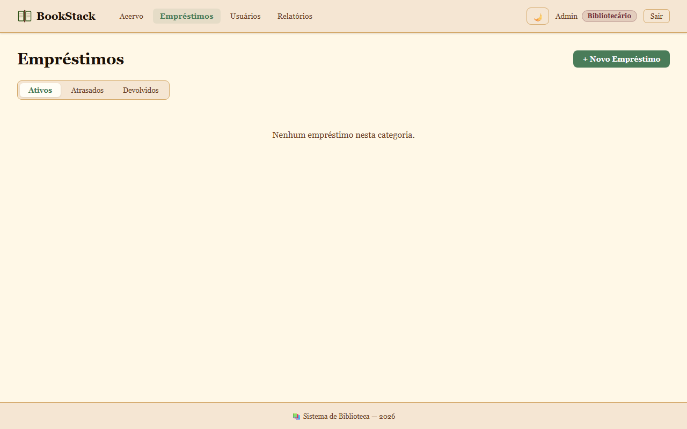
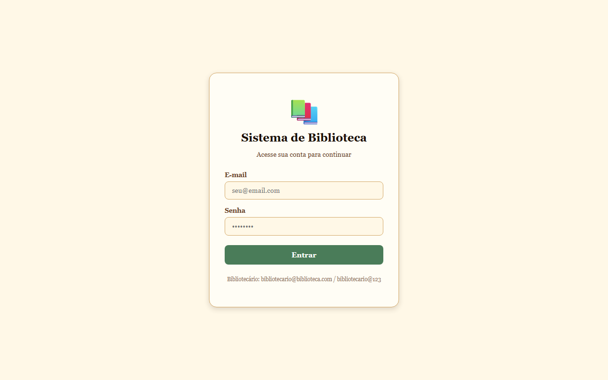
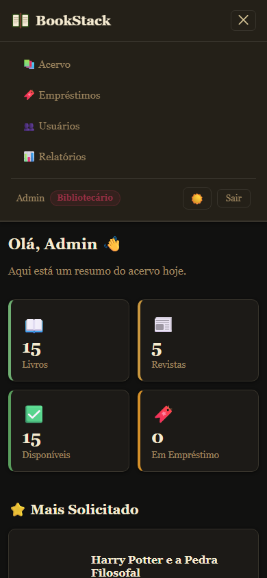
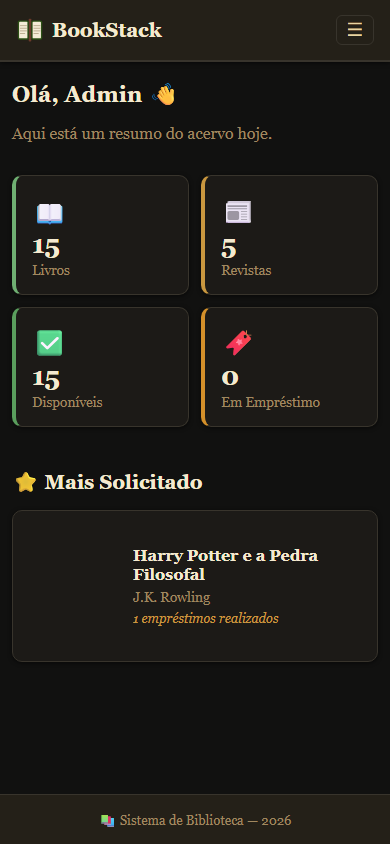
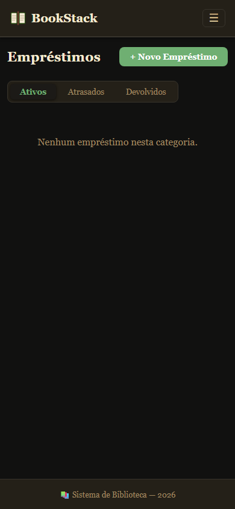

# BookStack — Sistema de Gerenciamento de Biblioteca

Sistema web completo para gerenciamento de acervo e empréstimos de bibliotecas, com controle de acesso por perfil, tema claro/escuro e responsividade mobile.

---

## Telas

### Dashboard


### Acervo — Modo Claro


### Acervo — Modo Escuro


### Empréstimos


### Login


### Mobile — Menu e Dashboard
<p>
  
  &nbsp;&nbsp;
  
  &nbsp;&nbsp;
  
</p>

---

## Stack

**Frontend** (`biblioteca-front/`)
- React 19 + TypeScript + Vite
- styled-components (temas, responsividade)
- Zustand (estado global)
- React Router v6
- Axios

**Backend** (`biblioteca-back/`)
- ASP.NET Core 10
- Entity Framework Core — Code First, TPH inheritance
- PostgreSQL (Neon cloud)
- JWT Authentication (BCrypt.Net)
- AutoMapper + Repository Pattern

---

## Funcionalidades

### Controle de Acesso por Perfil

| Funcionalidade | Bibliotecário | Aluno |
|---|:---:|:---:|
| Ver todo o acervo | ✅ | ✅ |
| Cadastrar / editar / excluir itens | ✅ | ❌ |
| Ver todos os empréstimos | ✅ | ❌ |
| Ver apenas os próprios empréstimos | ✅ | ✅ |
| Registrar empréstimo para qualquer aluno | ✅ | ❌ |
| Registrar empréstimo para si mesmo | ✅ | ✅ |
| Ver / gerenciar usuários | ✅ | ❌ |
| Relatórios completos | ✅ | Somente os próprios |

### Páginas

| Rota | Descrição |
|---|---|
| `/` | Dashboard com contadores de acervo e livro mais solicitado |
| `/acervo` | Grid de itens com filtro por tipo (Livros / Revistas) e busca por título |
| `/livros/novo` e `/livros/:id/editar` | Formulário de cadastro e edição de livros |
| `/revistas/novo` e `/revistas/:id/editar` | Formulário de cadastro e edição de revistas |
| `/emprestimos` | Listagem em abas: Ativos, Atrasados, Devolvidos |
| `/emprestimos/novo` | Novo empréstimo (bibliotecário escolhe o aluno; aluno emprestima para si) |
| `/usuarios` | Tabela de usuários (Bibliotecário apenas) |
| `/relatorios` | Livro mais solicitado + empréstimos ativos com situação de prazo |
| `/login` | Autenticação via e-mail e senha |

### Outras funcionalidades
- **Tema claro/escuro** persistido no `localStorage`
- **Responsivo** para mobile: header com menu hamburger (≤768px), tabelas viram cards empilhados (≤640px)
- Capas de livros via Open Library Covers API
- Seed automático de 3 usuários + 15 livros + 5 revistas no startup

---

## Como rodar

### Pré-requisitos

- Node.js 18+
- .NET 10 SDK
- Acesso ao banco PostgreSQL (Neon) — configurado em `biblioteca-back/biblioteca-back/appsettings.Development.json`

### Backend

```bash
cd biblioteca-back
dotnet run --project biblioteca-back
# API disponível em http://localhost:5000
# Swagger em http://localhost:5000/swagger
```

### Frontend

```bash
cd biblioteca-front
npm install
npm run dev
# App disponível em http://localhost:5173
```

---

## Usuários de demonstração

Criados automaticamente no startup do backend:

| E-mail | Senha | Perfil |
|---|---|---|
| `admin@biblioteca.com` | `Admin@123` | Bibliotecário |
| `bibliotecario@biblioteca.com` | `bibliotecario@123` | Bibliotecário |
| `aluno@biblioteca.com` | `aluno@123` | Aluno |

---

## Estrutura do projeto

```
biblioteca/
├── README.md
├── biblioteca-front/          # App React
│   └── src/
│       ├── pages/             # Uma pasta por página com index.tsx + index.style.ts
│       ├── components/        # header, layout, card-item, badge-status, modal
│       ├── stores/            # Zustand: auth, itens, empréstimos, usuários
│       ├── theme/             # lightTheme / darkTheme + ThemeContext
│       ├── types/entities.ts  # Todas as interfaces TypeScript
│       └── config/api.ts      # Axios com baseURL e interceptor de token
└── biblioteca-back/           # API .NET
    └── biblioteca-back/
        ├── Controllers/       # Endpoints REST com autorização por role
        ├── Services/          # Lógica de negócio
        ├── Repositories/      # Acesso a dados (Repository Pattern)
        ├── Models/            # Entidades com herança TPH
        ├── DTOs/              # Contratos de entrada e saída
        └── Migrations/        # EF Core Code First
```

---

## Decisões técnicas

| Decisão | Motivo |
|---|---|
| Herança TPH (Livro / Revista) | Uma tabela `ItensBiblioteca` — polimorfismo via EF Core discriminador |
| `JsonStringEnumConverter` | Enums trafegam como strings (`"Disponivel"`, `"Ativo"`) em vez de números |
| `ClaimTypes.NameIdentifier` no JWT | Permite que controllers identifiquem o usuário sem query ao banco |
| Zustand em vez de Redux | API simples e sem boilerplate para um domínio pequeno |
| styled-components com `DefaultTheme` | Tipagem total das props de tema em todos os componentes |
| `data-label` + CSS `::before` nas tabelas | Transforma tabelas em cards mobile sem JS extra |
